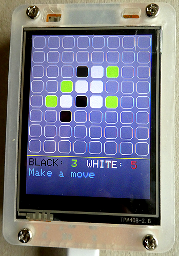
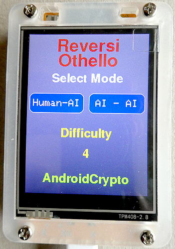

# ESP32 Cheap Yello Display ("CYD") Othello (or Reversi) Game
The ESP32 Cheap Yellow Device is a fantastic device as it comes with a 2.8-inches TFT display with Touch Controller and SD Card Reader mounted on the PCB. This is the ideal platform to run a touch based Othello / Reversi game.

This is the accompanying repository for my article "**Playing Othello / Reversi on an ESP32 Cheap Yellow Display with Minimax intelligence for the AI opponent**" available here: https://medium.com/@androidcrypto/playing-othello-reversi-on-an-esp32-cheap-yellow-display-with-minimax-intelligence-for-the-ai-07394729e653



## Note on the origin of the code

The main game code is fully taken from the 'Othello' example provided with the Minimax library, so all rights and comments go to the author of this library, **Trent M. Wyatt**. To make the game playable on a TFT display with touch support, I added some code (display driver, buttons and reaction on touch events). As I doesn't want to rewrite the original code in complete I already left most of the outputs on the Serial Monitor - just the 'inputs' by the Serial Monitor interface are no longer active.

## Required Libraries
````plaintext
LovyanGFX by lovyan03 version 1.2.7 (https://github.com/lovyan03/LovyanGFX)
Minimax library by Trent M. Wyatt (ripred) version 1.0.0 (https://github.com/ripred/Minimax)
````

## Set up the LovyanGFX library

The LovyanGFX library has a different concept for the display and touch controller settings in contrast to the TFT_eSPI library: the settings are enclosed with the main sketch.

As the ESP32 CYD device comes in two variants I included both driver settings within the sketch folder:

If you own an older version (one Micro-USB port) your display is driven by an **ILI9341** driver chip, newer boards (one Micro-USB and one USB-C port) are using an **ST7789** driver chip. Both of them should use a resistive touch controller of type **XPT2046**.

**ILI9341**: LovyanGFX_CYD_ILI9341_Settings.h

**ST7789**: LovyanGFX_CYD_ST7789_Settings.h

Please select the matching driver by uncommenting a line in *Display_Logic.h*:
````plaintext
//#include "LovyanGFX_CYD_ILI9341_Settings.h"
#include "LovyanGFX_CYD_ST7789_Settings.h"
````

## Set up the difficulty (machine player strength)

Define the difficulty (or, better, the strength of the machine) in the main sketch: "#define MINIMAX_DEPTH 4". A value of 2 is the fastest and lowest strength, a value of 10 is getting very slow (the machine will calculate some minutes before executing the next move). I set the difficulty to "4", but believe me, it is hard to win against the machine with this setting :-).



## Development Environment
````plaintext
Arduino IDE Version 2.3.6 (Windows)
arduino-esp32 boards Version 3.2.0 (https://github.com/espressif/arduino-esp32)
````
